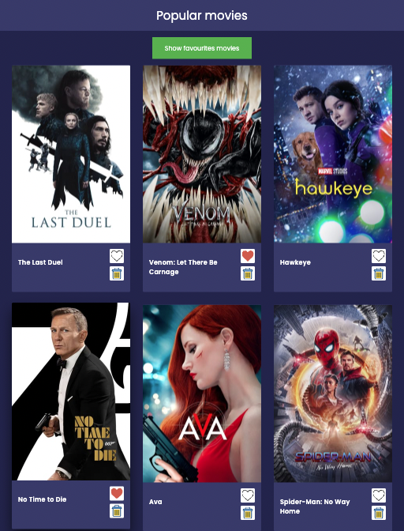

## Проект SPA приложения со списком карточек (популярных фильмов).

https://objective-swanson-7fb981.netlify.app/

<p align="center">
  
</p>

## Запуск проекта: 

1) В корне проекта создать файл .env по образцу env_sample.txt, куда нужно внести персональный ключ для API (https://www.themoviedb.org/documentation/api)

2) Прописать в консоли следующие команды:

```bash
npm i
npm start
```


3) Открыть в браузере по адресу: [http://localhost:3000](http://localhost:3000).
